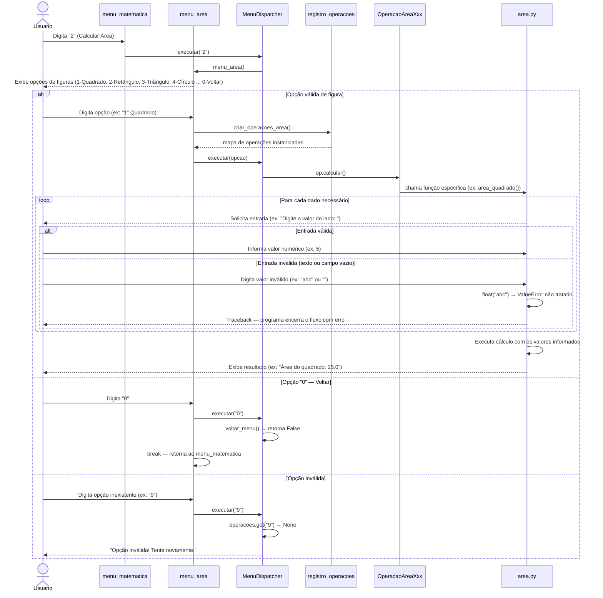

# DS - US01: Calcular Área de Figuras Geométricas

**User Story:** Como estudante, eu quero calcular a área de diferentes figuras geométricas, para que eu possa resolver exercícios de matemática com rapidez.

---

