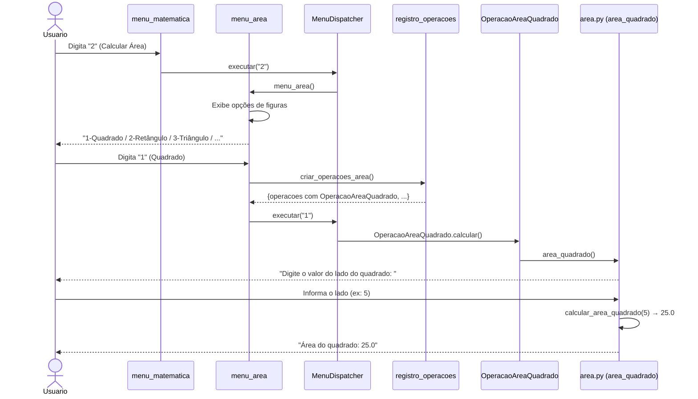
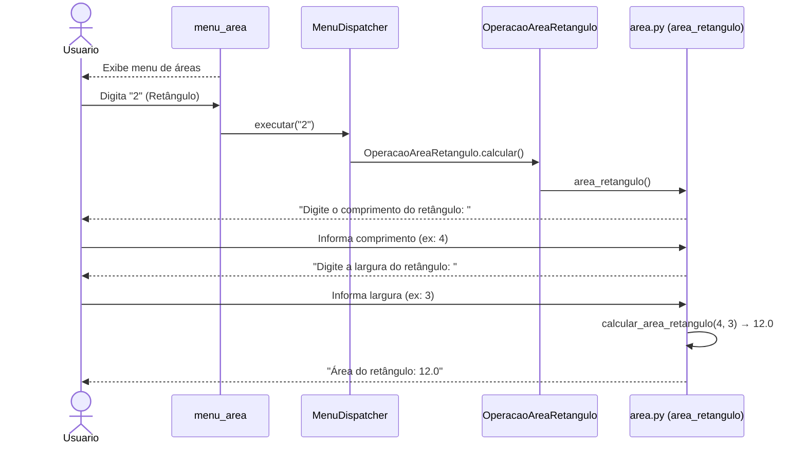
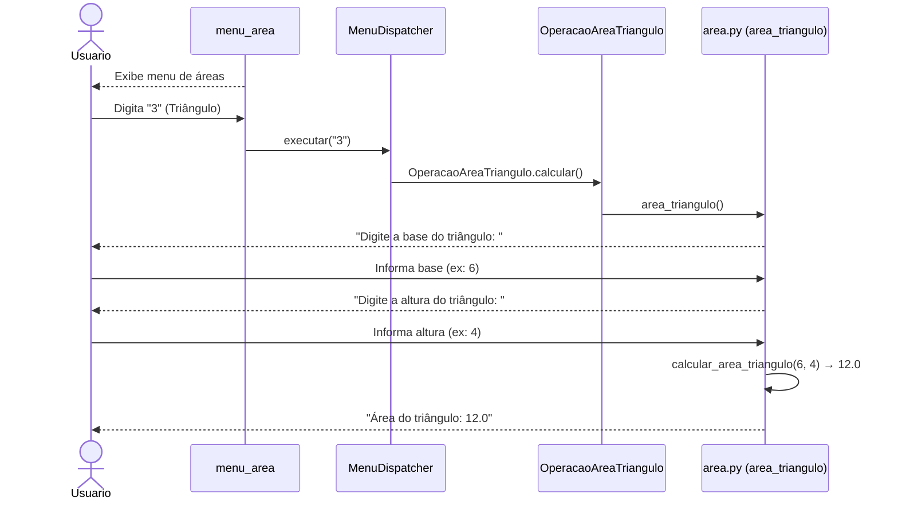
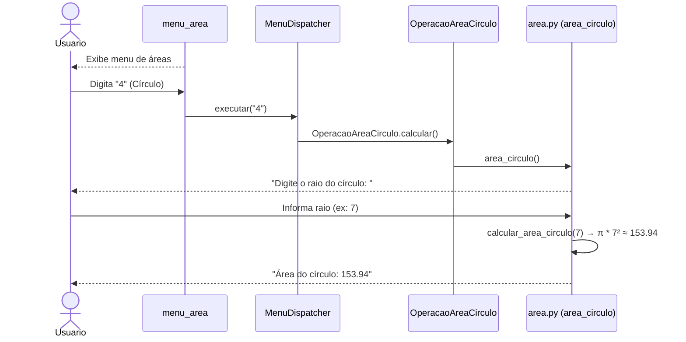
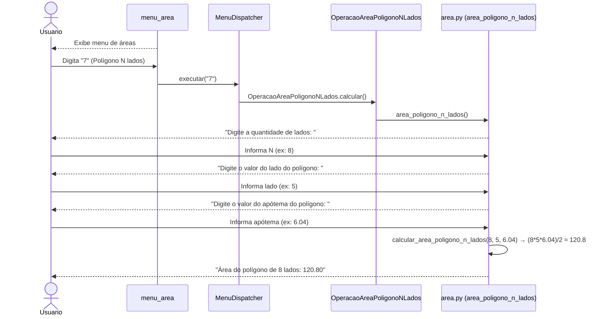
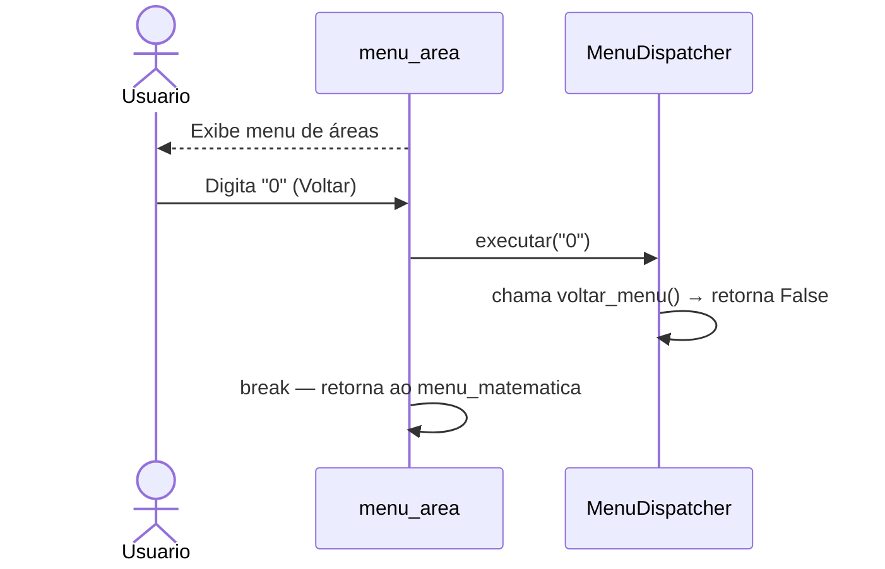
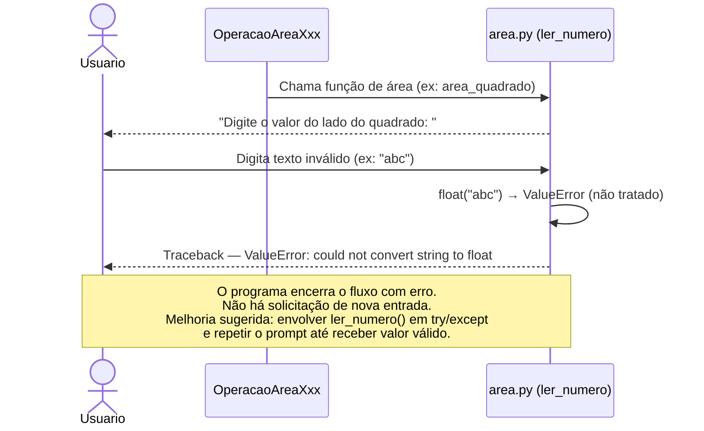
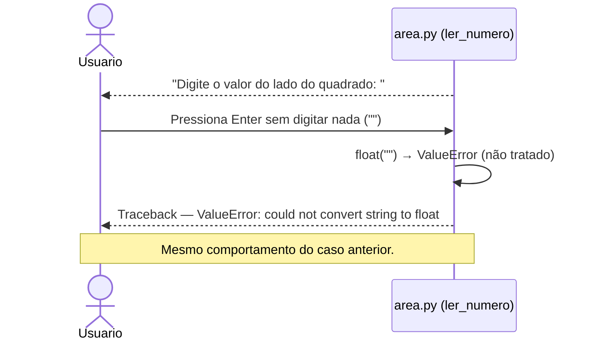

# DS - US01: Calcular Área de Figuras Geométricas

**User Story:** Como estudante, eu quero calcular a área de diferentes figuras geométricas, para que eu possa resolver exercícios de matemática com rapidez.

---

## Fluxo Principal — Calcular Área do Quadrado

---

## Fluxo Alternativo — Calcular Área do Retângulo

---

## Fluxo Alternativo — Calcular Área do Triângulo

---

## Fluxo Alternativo — Calcular Área do Círculo

---

## Fluxo Alternativo — Calcular Área do Polígono de N Lados

---

## Fluxo — Voltar ao Menu Anterior

---

## Fluxo de Exceção — Entrada Inválida (dado não numérico)

---

## Fluxo de Exceção — Campo em Branco

