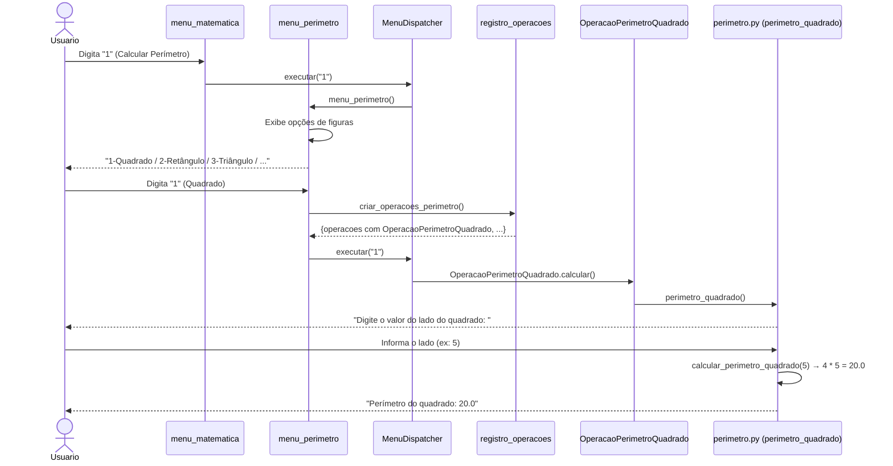
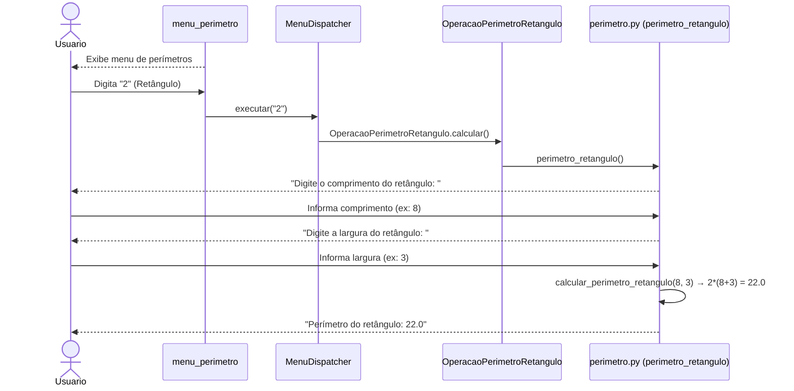
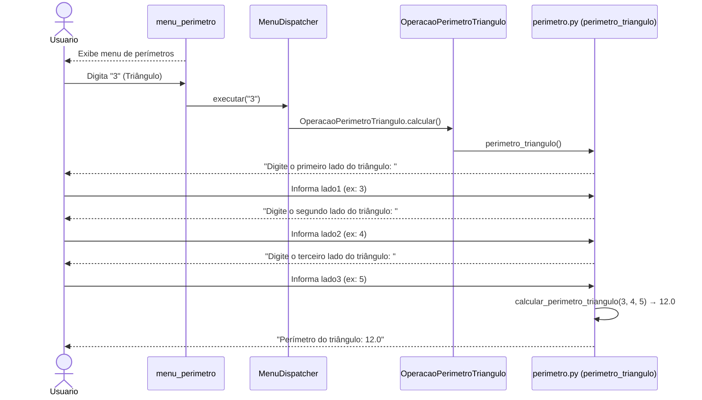
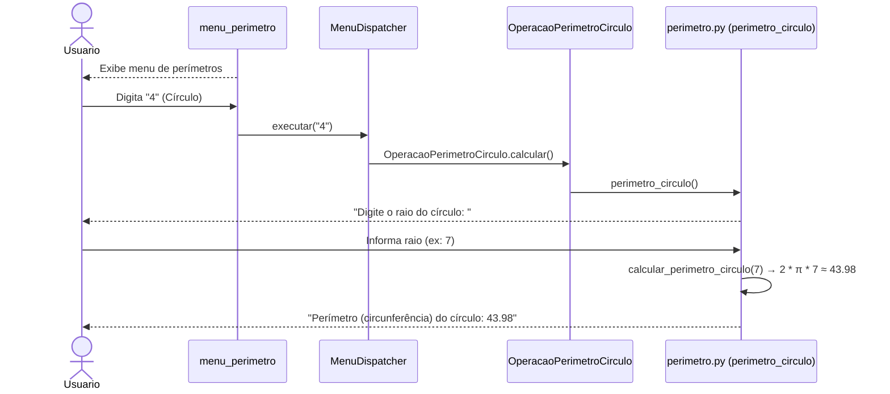
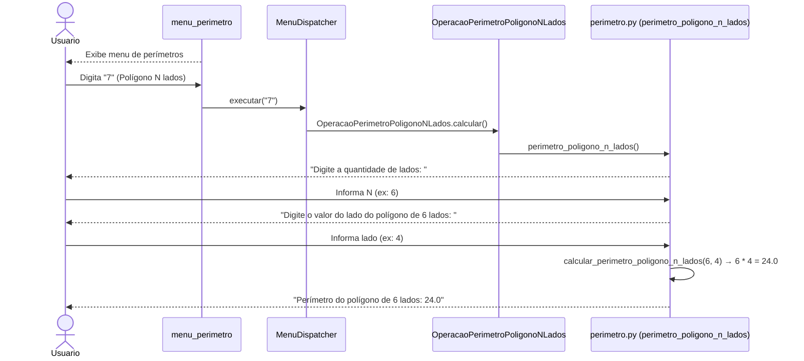
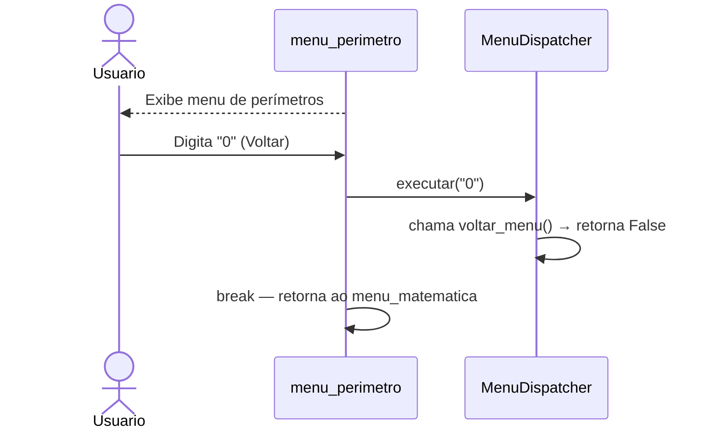
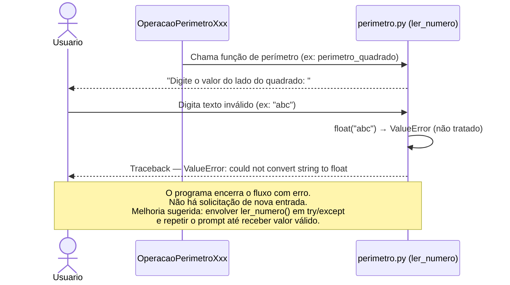
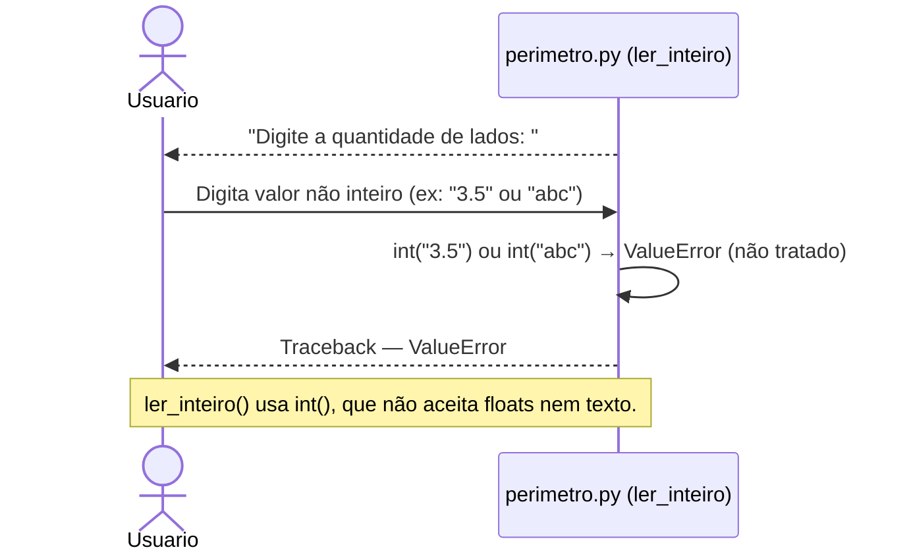
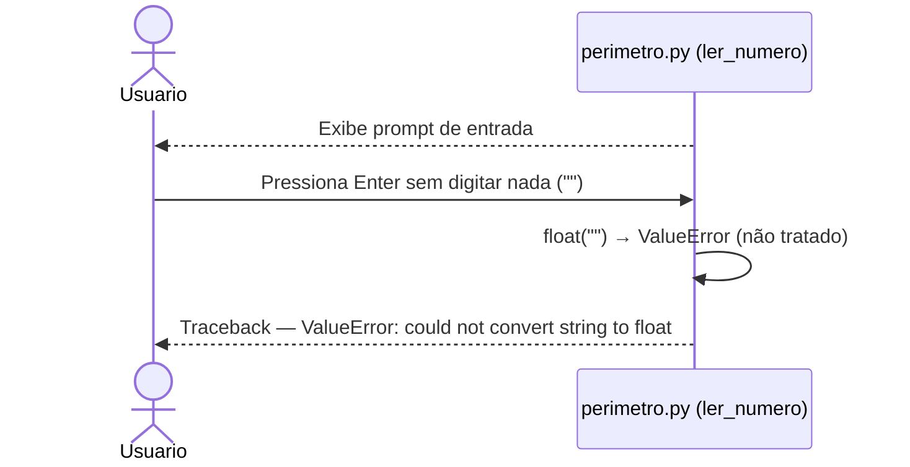

# DS - US02: Calcular Perímetro de Figuras Geométricas

**User Story:** Como estudante, eu quero calcular o perímetro de figuras geométricas, para que eu possa conferir os resultados dos meus exercícios.

---

## Fluxo Principal — Calcular Perímetro do Quadrado

---

## Fluxo Alternativo — Calcular Perímetro do Retângulo

---

## Fluxo Alternativo — Calcular Perímetro do Triângulo

---

## Fluxo Alternativo — Calcular Perímetro do Círculo

---

## Fluxo Alternativo — Calcular Perímetro do Polígono de N Lados

---

## Fluxo — Voltar ao Menu Anterior

---

## Fluxo de Exceção — Entrada Inválida (dado não numérico)

---

## Fluxo de Exceção — Quantidade de Lados Inválida (polígono N lados)

---

## Fluxo de Exceção — Campo em Branco

