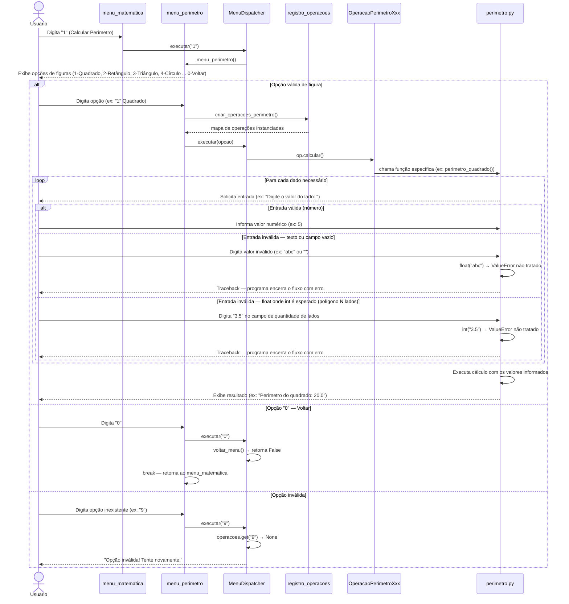

# DS - US02: Calcular Perímetro de Figuras Geométricas

**User Story:** Como estudante, eu quero calcular o perímetro de figuras geométricas, para que eu possa conferir os resultados dos meus exercícios.

---

