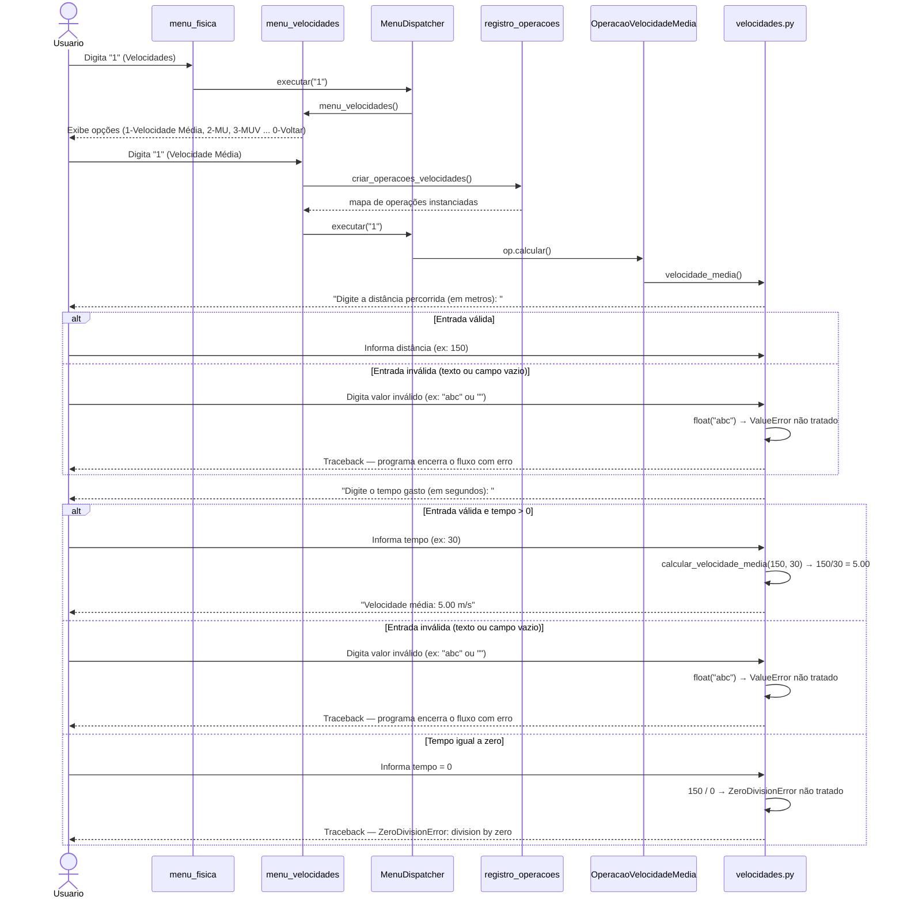

# DS - US03: Calcular Velocidade Média

**User Story:** Como estudante de física, eu quero calcular a velocidade média, para que eu possa resolver problemas de cinemática.

---

```mermaid
sequenceDiagram
    actor Usuario
    participant MenuFis as menu_fisica
    participant MenuVel as menu_velocidades
    participant Dispatcher as MenuDispatcher
    participant Registro as registro_operacoes
    participant Op as OperacaoVelocidadeMedia
    participant Calc as velocidades.py

    Usuario->>MenuFis: Digita "1" (Velocidades)
    MenuFis->>Dispatcher: executar("1")
    Dispatcher->>MenuVel: menu_velocidades()
    MenuVel-->>Usuario: Exibe opções (1-Velocidade Média, 2-MU, 3-MUV ... 0-Voltar)

    Usuario->>MenuVel: Digita "1" (Velocidade Média)
    MenuVel->>Registro: criar_operacoes_velocidades()
    Registro-->>MenuVel: mapa de operações instanciadas
    MenuVel->>Dispatcher: executar("1")
    Dispatcher->>Op: op.calcular()
    Op->>Calc: velocidade_media()

    Calc-->>Usuario: "Digite a distância percorrida (em metros): "
    alt Entrada válida
        Usuario->>Calc: Informa distância (ex: 150)
    else Entrada inválida (texto ou campo vazio)
        Usuario->>Calc: Digita valor inválido (ex: "abc" ou "")
        Calc->>Calc: float("abc") → ValueError não tratado
        Calc-->>Usuario: Traceback — programa encerra o fluxo com erro
    end

    Calc-->>Usuario: "Digite o tempo gasto (em segundos): "
    alt Entrada válida e tempo > 0
        Usuario->>Calc: Informa tempo (ex: 30)
        Calc->>Calc: calcular_velocidade_media(150, 30) → 150/30 = 5.00
        Calc-->>Usuario: "Velocidade média: 5.00 m/s"
    else Entrada inválida (texto ou campo vazio)
        Usuario->>Calc: Digita valor inválido (ex: "abc" ou "")
        Calc->>Calc: float("abc") → ValueError não tratado
        Calc-->>Usuario: Traceback — programa encerra o fluxo com erro
    else Tempo igual a zero
        Usuario->>Calc: Informa tempo = 0
        Calc->>Calc: 150 / 0 → ZeroDivisionError não tratado
        Calc-->>Usuario: Traceback — ZeroDivisionError: division by zero
    end
```
