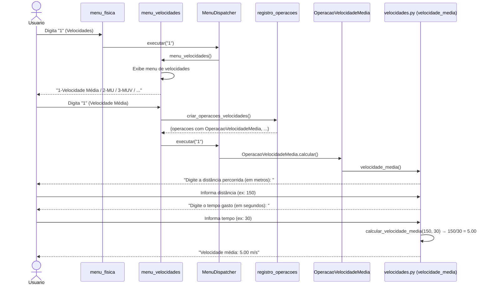
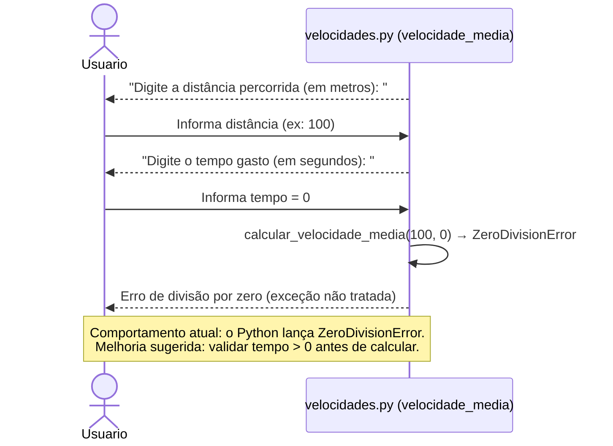
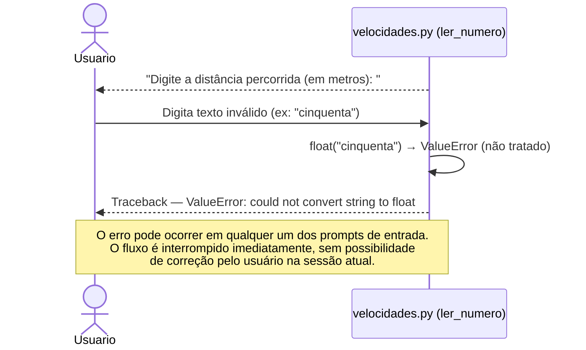
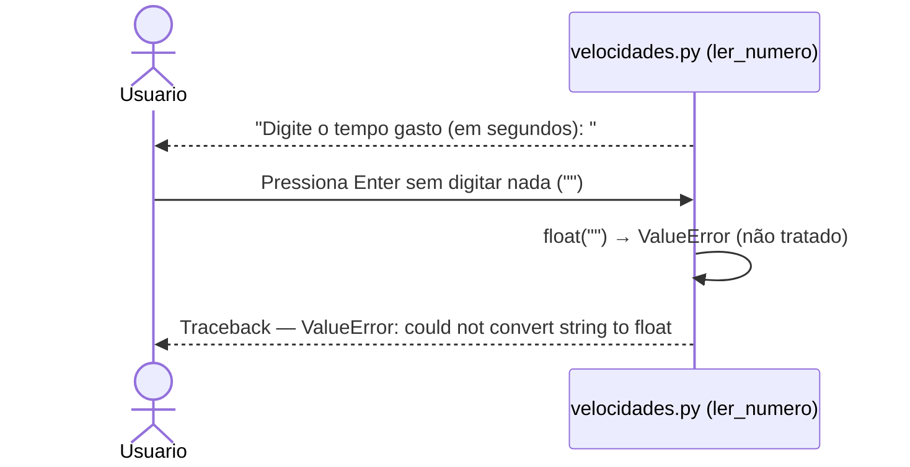

# DS - US03: Calcular Velocidade Média

**User Story:** Como estudante de física, eu quero calcular a velocidade média, para que eu possa resolver problemas de cinemática.

---

## Fluxo Principal — Calcular Velocidade Média

---

## Fluxo de Exceção — Tempo igual a zero

---

## Fluxo de Exceção — Entrada Inválida (dado não numérico)

---

## Fluxo de Exceção — Campo em Branco

