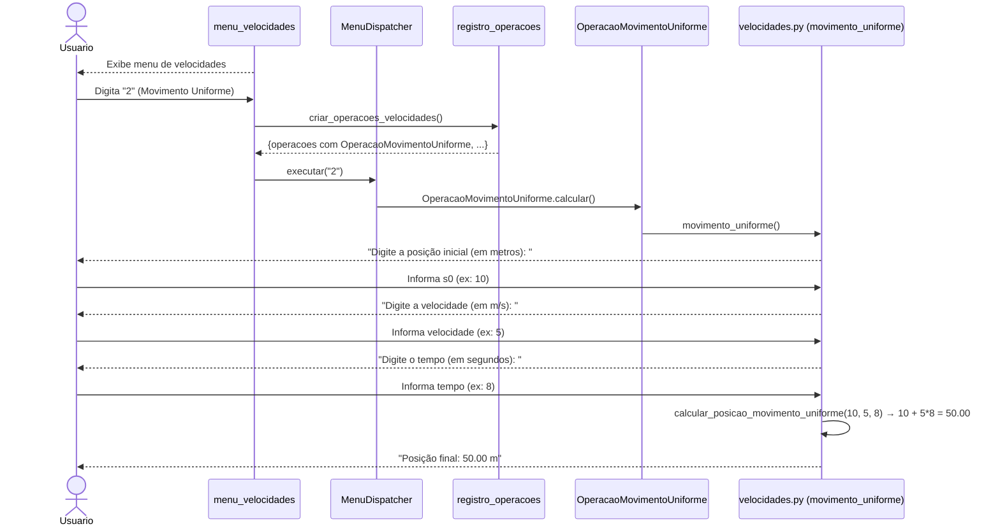
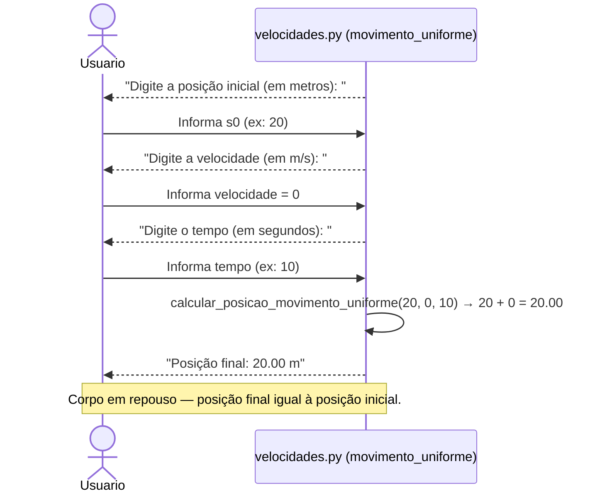
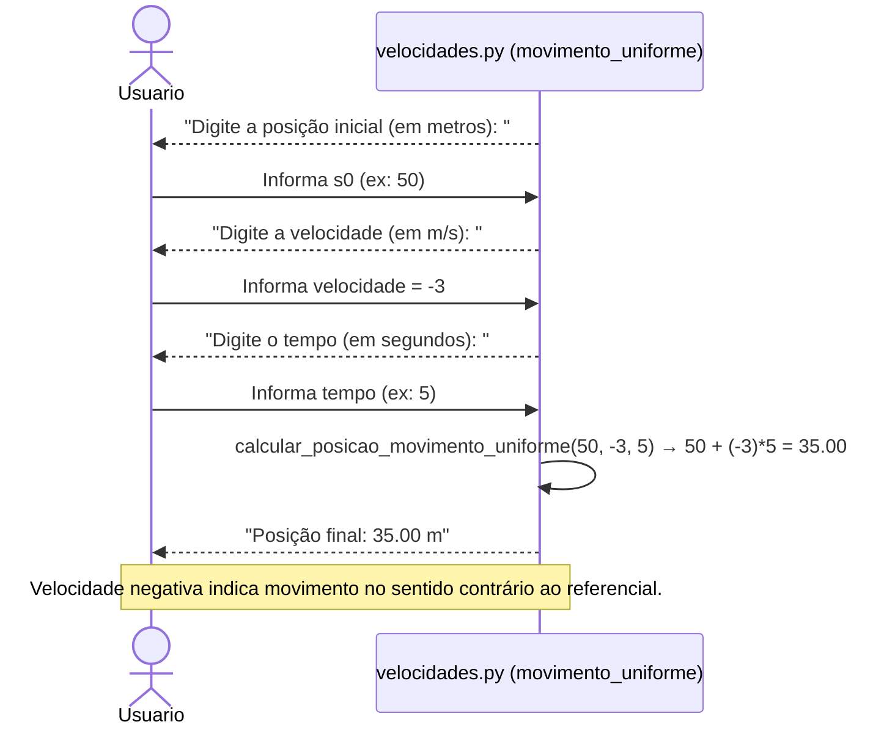
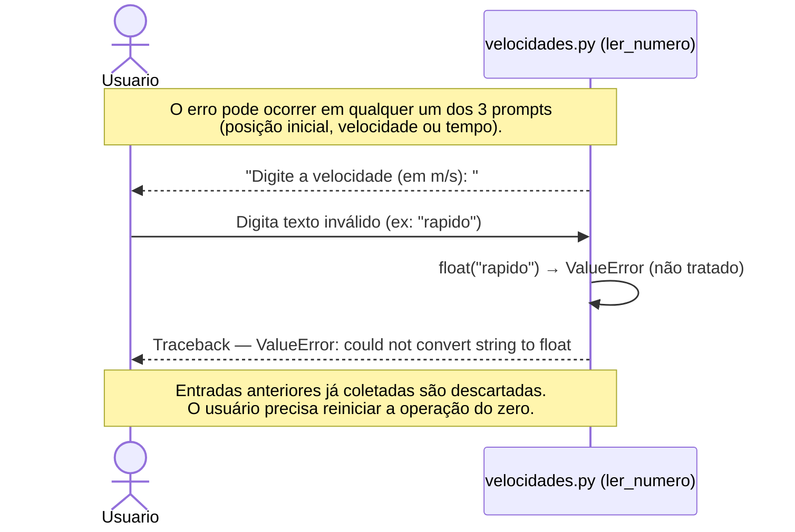
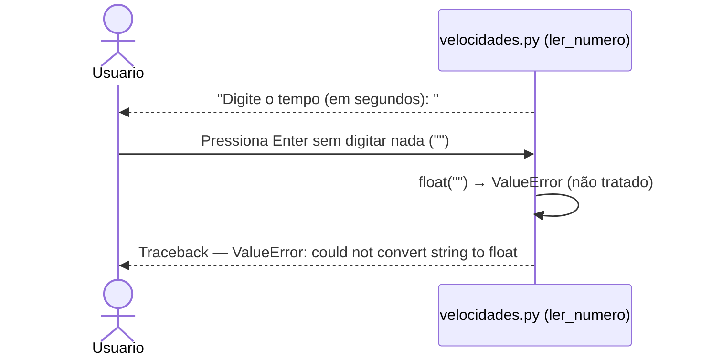

# DS - US04: Calcular Movimento Uniforme (MU)

**User Story:** Como estudante, eu quero calcular o movimento uniforme, para que eu possa compreender o deslocamento de um corpo.

---

## Fluxo Principal — Calcular Posição Final no MU

---

## Fluxo Alternativo — Corpo em repouso (velocidade = 0)

---

## Fluxo Alternativo — Velocidade negativa (movimento em sentido contrário)

---

## Fluxo de Exceção — Entrada Inválida (dado não numérico)

---

## Fluxo de Exceção — Campo em Branco

