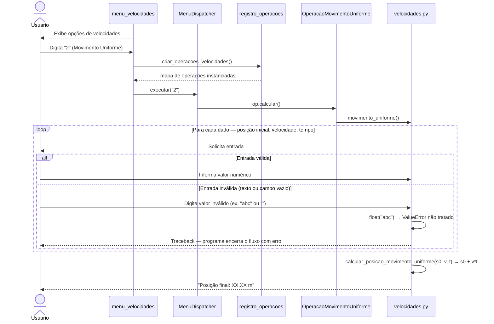

# DS - US04: Calcular Movimento Uniforme (MU)

**User Story:** Como estudante, eu quero calcular o movimento uniforme, para que eu possa compreender o deslocamento de um corpo.

---

```mermaid
sequenceDiagram
    actor Usuario
    participant MenuVel as menu_velocidades
    participant Dispatcher as MenuDispatcher
    participant Registro as registro_operacoes
    participant Op as OperacaoMovimentoUniforme
    participant Calc as velocidades.py

    MenuVel-->>Usuario: Exibe opções de velocidades
    Usuario->>MenuVel: Digita "2" (Movimento Uniforme)
    MenuVel->>Registro: criar_operacoes_velocidades()
    Registro-->>MenuVel: mapa de operações instanciadas
    MenuVel->>Dispatcher: executar("2")
    Dispatcher->>Op: op.calcular()
    Op->>Calc: movimento_uniforme()

    loop Para cada dado — posição inicial, velocidade, tempo
        Calc-->>Usuario: Solicita entrada
        alt Entrada válida
            Usuario->>Calc: Informa valor numérico
        else Entrada inválida (texto ou campo vazio)
            Usuario->>Calc: Digita valor inválido (ex: "abc" ou "")
            Calc->>Calc: float("abc") → ValueError não tratado
            Calc-->>Usuario: Traceback — programa encerra o fluxo com erro
        end
    end

    Calc->>Calc: calcular_posicao_movimento_uniforme(s0, v, t) → s0 + v*t
    Calc-->>Usuario: "Posição final: XX.XX m"
```
