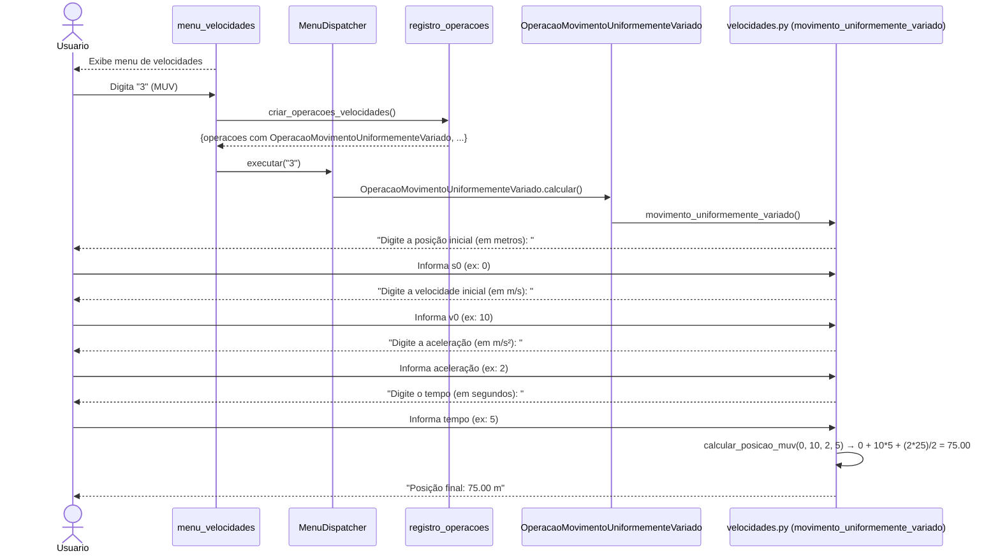
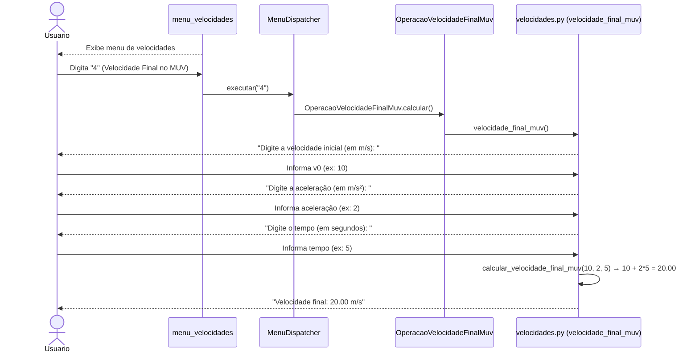
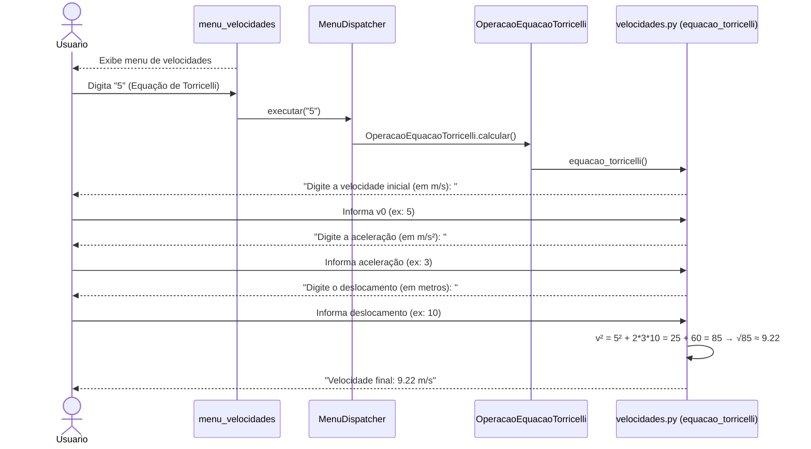
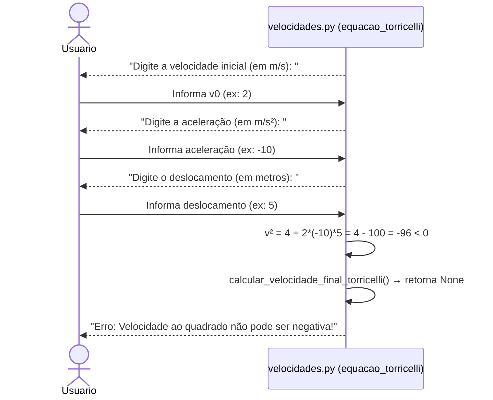
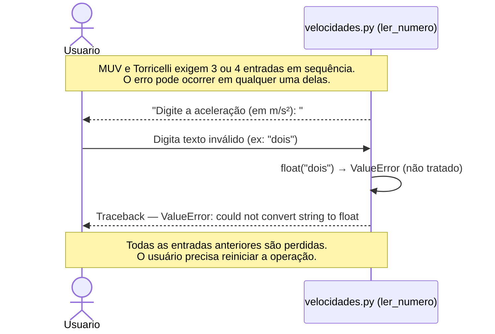
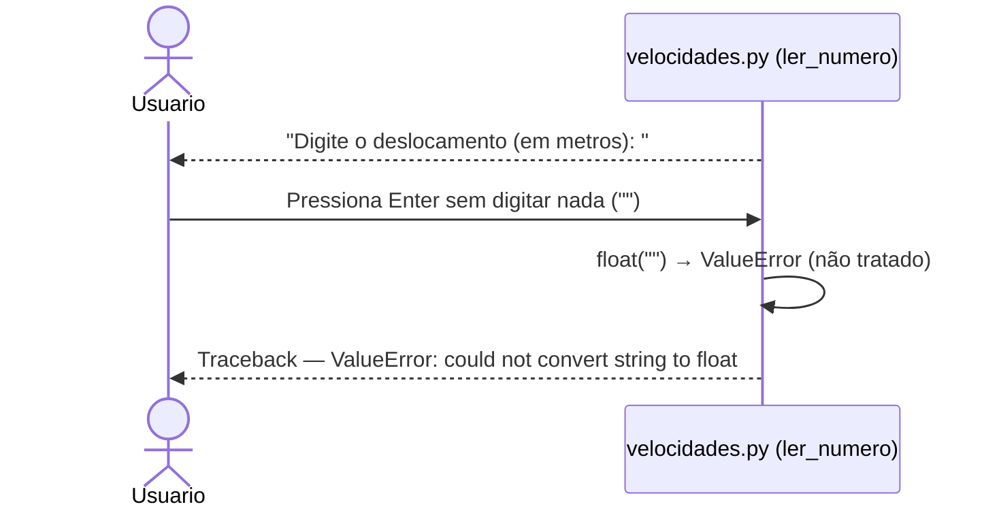

# DS - US05: Calcular Movimento Uniformemente Variado (MUV)

**User Story:** Como estudante, eu quero calcular problemas de MUV, para que eu possa resolver exercícios de física.

---

## Fluxo Principal — Calcular Posição Final no MUV

---

## Fluxo Alternativo — Calcular Velocidade Final no MUV

---

## Fluxo Alternativo — Calcular via Equação de Torricelli

---

## Fluxo de Exceção — Torricelli com resultado negativo sob raiz

---

## Fluxo de Exceção — Entrada Inválida (dado não numérico)

---

## Fluxo de Exceção — Campo em Branco

