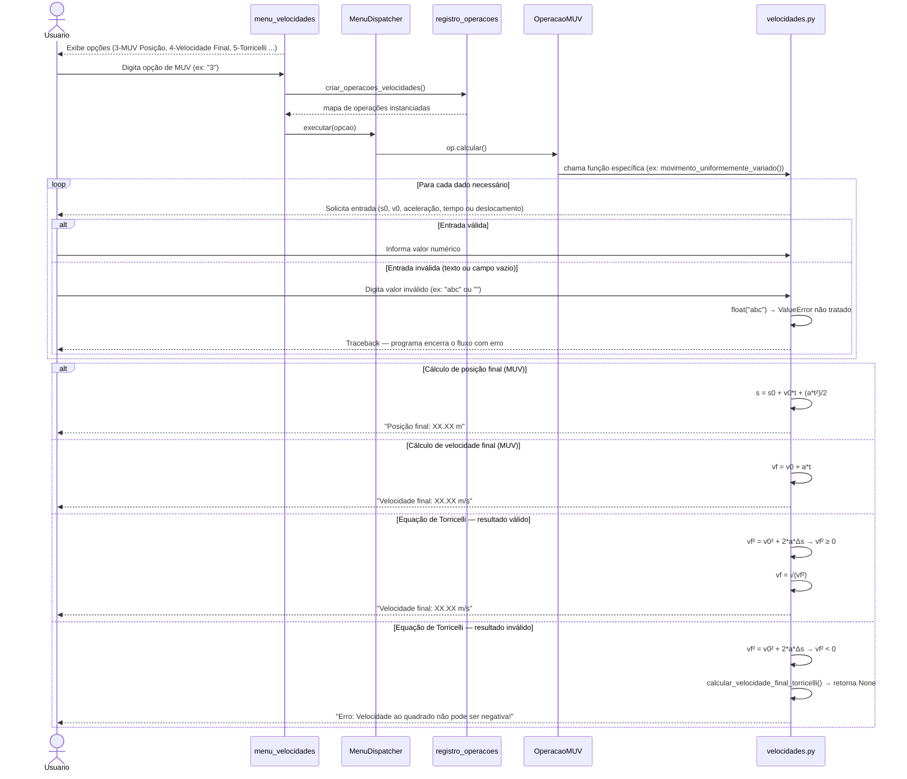

# DS - US05: Calcular Movimento Uniformemente Variado (MUV)

**User Story:** Como estudante, eu quero calcular problemas de MUV, para que eu possa resolver exercícios de física.

---

```mermaid
sequenceDiagram
    actor Usuario
    participant MenuVel as menu_velocidades
    participant Dispatcher as MenuDispatcher
    participant Registro as registro_operacoes
    participant Op as OperacaoMUV
    participant Calc as velocidades.py

    MenuVel-->>Usuario: Exibe opções (3-MUV Posição, 4-Velocidade Final, 5-Torricelli ...)
    Usuario->>MenuVel: Digita opção de MUV (ex: "3")
    MenuVel->>Registro: criar_operacoes_velocidades()
    Registro-->>MenuVel: mapa de operações instanciadas
    MenuVel->>Dispatcher: executar(opcao)
    Dispatcher->>Op: op.calcular()
    Op->>Calc: chama função específica (ex: movimento_uniformemente_variado())

    loop Para cada dado necessário
        Calc-->>Usuario: Solicita entrada (s0, v0, aceleração, tempo ou deslocamento)
        alt Entrada válida
            Usuario->>Calc: Informa valor numérico
        else Entrada inválida (texto ou campo vazio)
            Usuario->>Calc: Digita valor inválido (ex: "abc" ou "")
            Calc->>Calc: float("abc") → ValueError não tratado
            Calc-->>Usuario: Traceback — programa encerra o fluxo com erro
        end
    end

    alt Cálculo de posição final (MUV)
        Calc->>Calc: s = s0 + v0*t + (a*t²)/2
        Calc-->>Usuario: "Posição final: XX.XX m"
    else Cálculo de velocidade final (MUV)
        Calc->>Calc: vf = v0 + a*t
        Calc-->>Usuario: "Velocidade final: XX.XX m/s"
    else Equação de Torricelli — resultado válido
        Calc->>Calc: vf² = v0² + 2*a*Δs → vf² ≥ 0
        Calc->>Calc: vf = √(vf²)
        Calc-->>Usuario: "Velocidade final: XX.XX m/s"
    else Equação de Torricelli — resultado inválido
        Calc->>Calc: vf² = v0² + 2*a*Δs → vf² < 0
        Calc->>Calc: calcular_velocidade_final_torricelli() → retorna None
        Calc-->>Usuario: "Erro: Velocidade ao quadrado não pode ser negativa!"
    end
```
