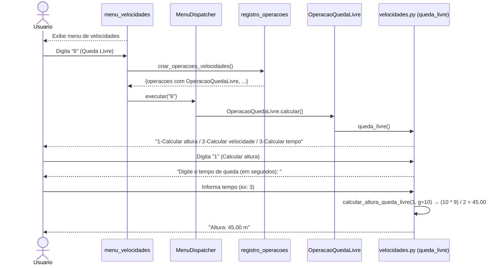
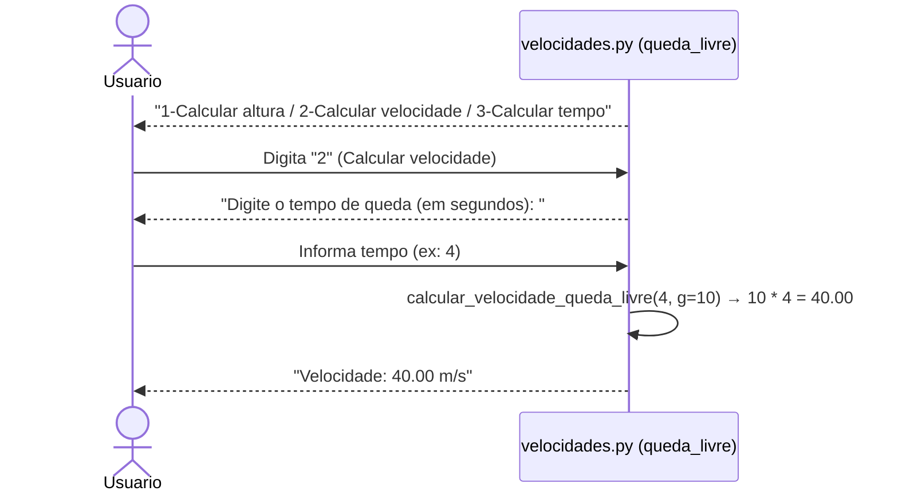
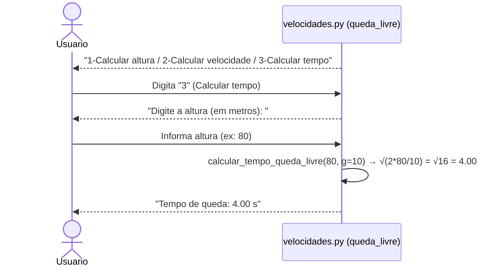
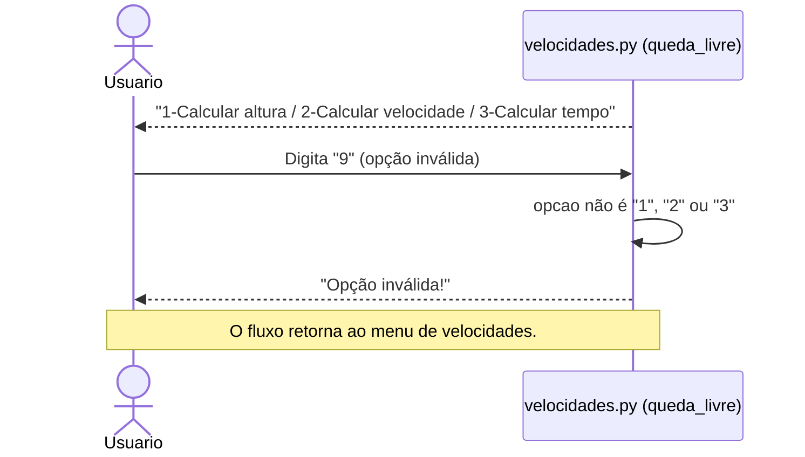
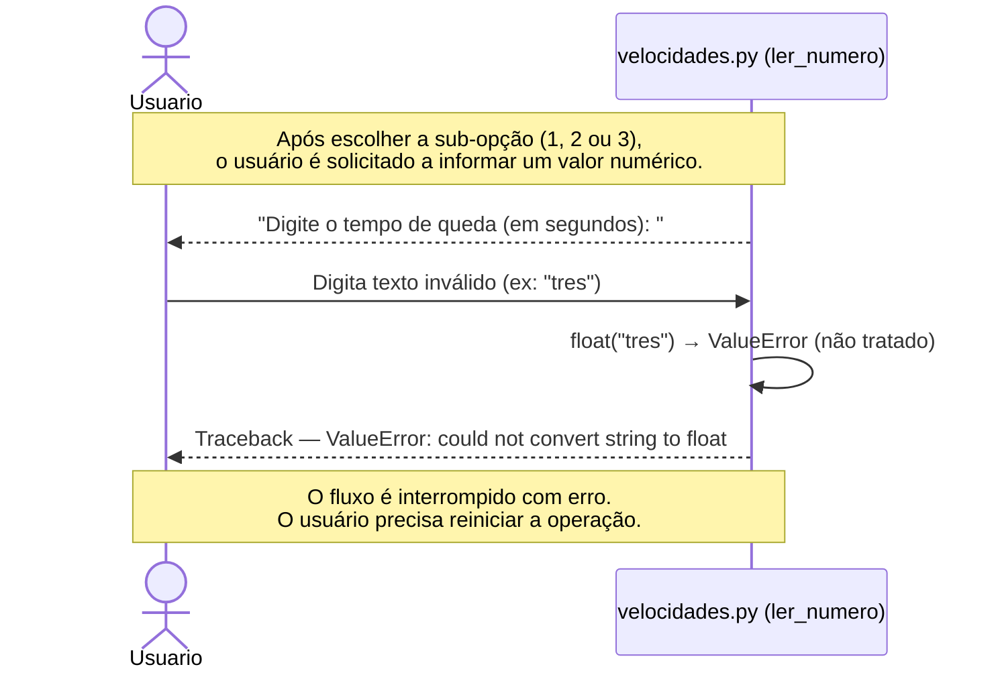
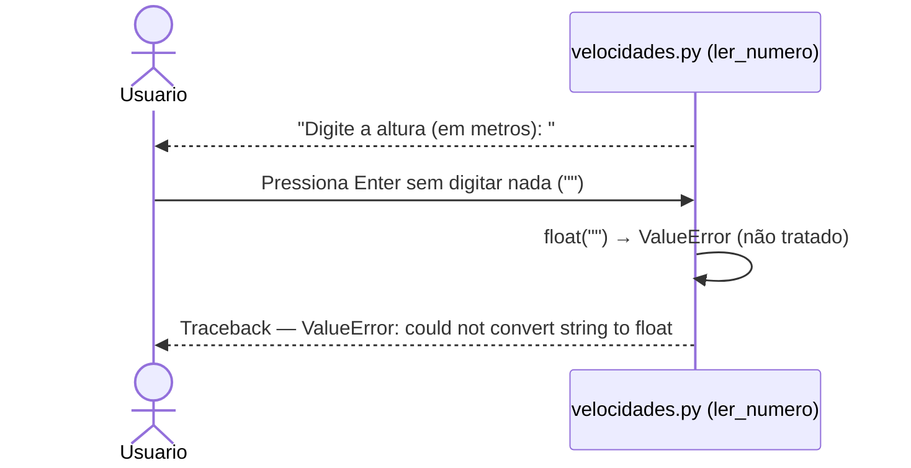

# DS - US06: Calcular Queda Livre

**User Story:** Como estudante, eu quero calcular situações de queda livre, para que eu possa analisar movimentos sob ação da gravidade.

---

## Fluxo Principal — Calcular Altura na Queda Livre

---

## Fluxo Alternativo — Calcular Velocidade na Queda Livre

---

## Fluxo Alternativo — Calcular Tempo de Queda Livre

---

## Fluxo de Exceção — Opção Inválida no Sub-menu

---

## Fluxo de Exceção — Entrada Inválida (dado não numérico)

---

## Fluxo de Exceção — Campo em Branco

