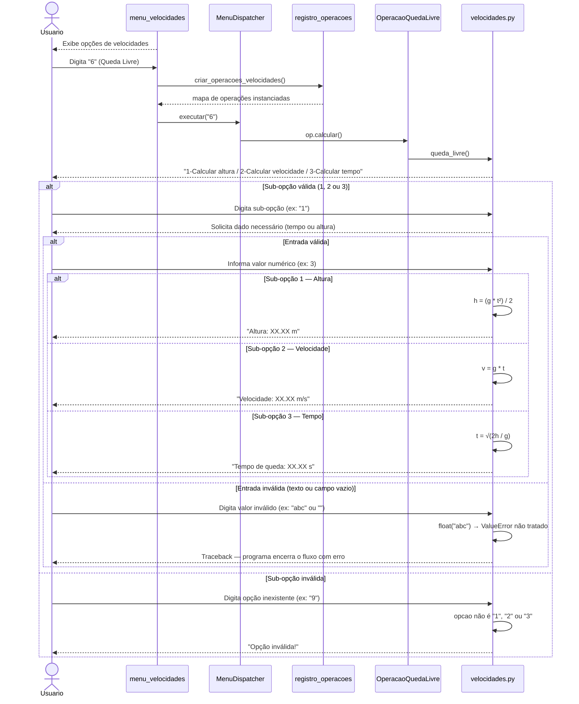

# DS - US06: Calcular Queda Livre

**User Story:** Como estudante, eu quero calcular situações de queda livre, para que eu possa analisar movimentos sob ação da gravidade.

---

```mermaid
sequenceDiagram
    actor Usuario
    participant MenuVel as menu_velocidades
    participant Dispatcher as MenuDispatcher
    participant Registro as registro_operacoes
    participant Op as OperacaoQuedaLivre
    participant Calc as velocidades.py

    MenuVel-->>Usuario: Exibe opções de velocidades
    Usuario->>MenuVel: Digita "6" (Queda Livre)
    MenuVel->>Registro: criar_operacoes_velocidades()
    Registro-->>MenuVel: mapa de operações instanciadas
    MenuVel->>Dispatcher: executar("6")
    Dispatcher->>Op: op.calcular()
    Op->>Calc: queda_livre()
    Calc-->>Usuario: "1-Calcular altura / 2-Calcular velocidade / 3-Calcular tempo"

    alt Sub-opção válida (1, 2 ou 3)
        Usuario->>Calc: Digita sub-opção (ex: "1")
        Calc-->>Usuario: Solicita dado necessário (tempo ou altura)

        alt Entrada válida
            Usuario->>Calc: Informa valor numérico (ex: 3)
            alt Sub-opção 1 — Altura
                Calc->>Calc: h = (g * t²) / 2
                Calc-->>Usuario: "Altura: XX.XX m"
            else Sub-opção 2 — Velocidade
                Calc->>Calc: v = g * t
                Calc-->>Usuario: "Velocidade: XX.XX m/s"
            else Sub-opção 3 — Tempo
                Calc->>Calc: t = √(2h / g)
                Calc-->>Usuario: "Tempo de queda: XX.XX s"
            end
        else Entrada inválida (texto ou campo vazio)
            Usuario->>Calc: Digita valor inválido (ex: "abc" ou "")
            Calc->>Calc: float("abc") → ValueError não tratado
            Calc-->>Usuario: Traceback — programa encerra o fluxo com erro
        end

    else Sub-opção inválida
        Usuario->>Calc: Digita opção inexistente (ex: "9")
        Calc->>Calc: opcao não é "1", "2" ou "3"
        Calc-->>Usuario: "Opção inválida!"
    end
```
