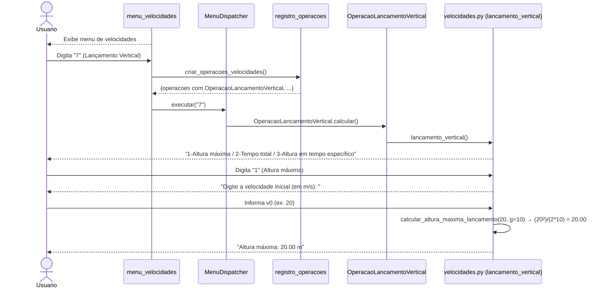
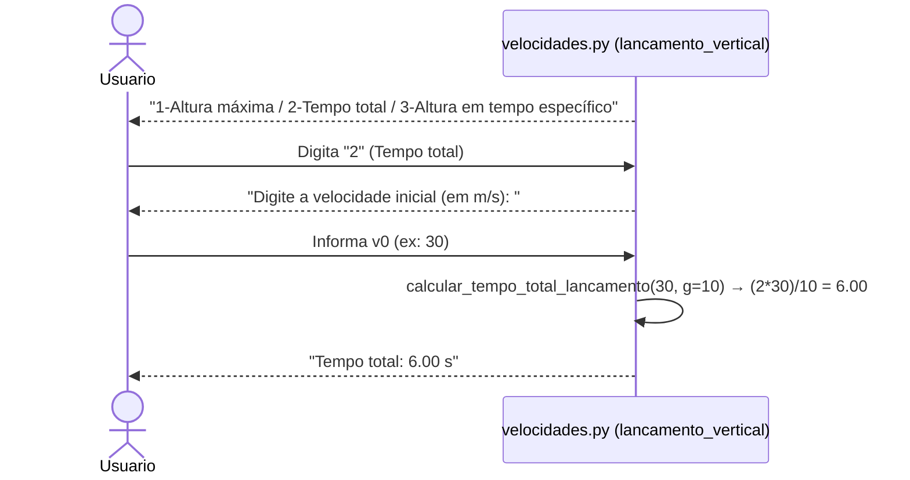
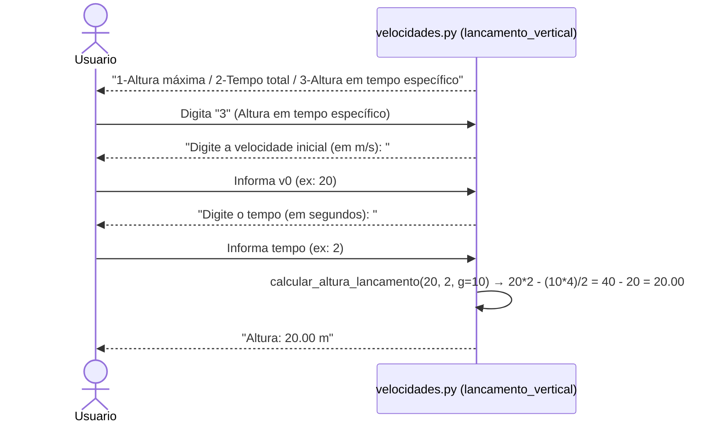
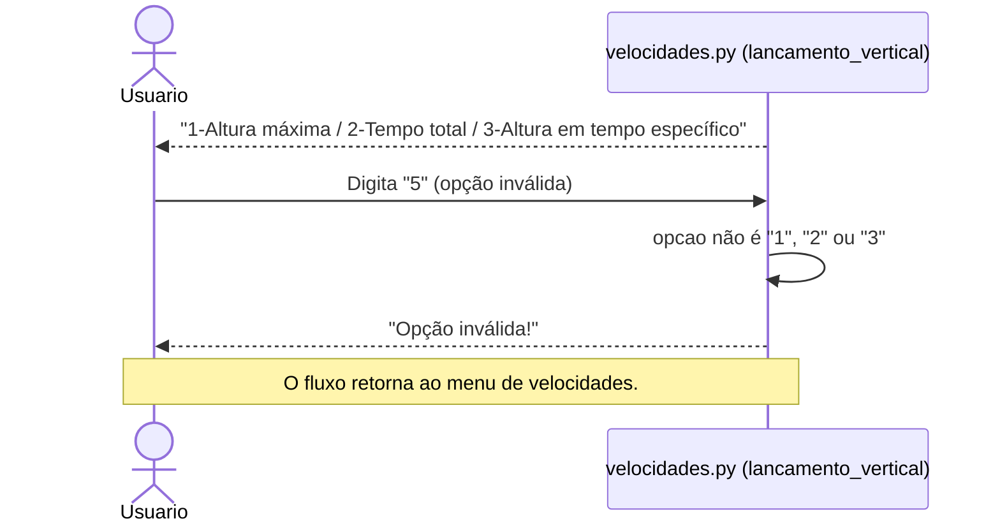
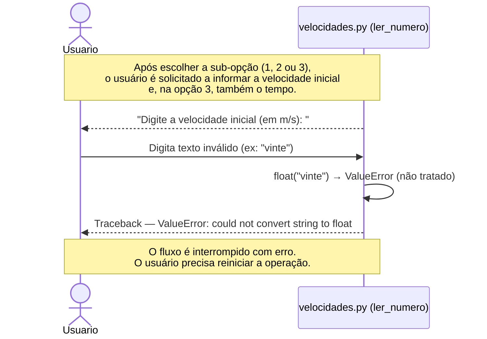
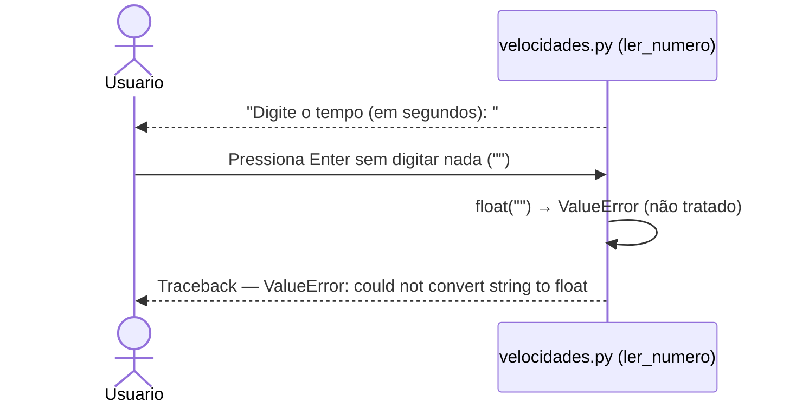

# DS - US07: Calcular Lançamento Vertical

**User Story:** Como estudante, eu quero calcular lançamentos verticais, para que eu possa resolver exercícios de física.

---

## Fluxo Principal — Calcular Altura Máxima

---

## Fluxo Alternativo — Calcular Tempo Total do Lançamento

---

## Fluxo Alternativo — Calcular Altura em Instante Específico

---

## Fluxo de Exceção — Opção Inválida no Sub-menu

---

## Fluxo de Exceção — Entrada Inválida (dado não numérico)

---

## Fluxo de Exceção — Campo em Branco

