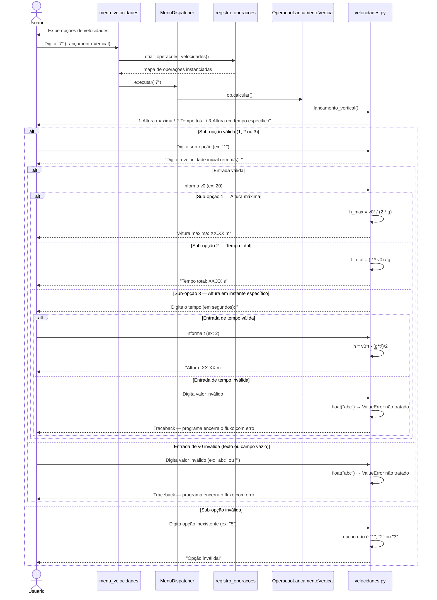

# DS - US07: Calcular Lançamento Vertical

**User Story:** Como estudante, eu quero calcular lançamentos verticais, para que eu possa resolver exercícios de física.

---

```mermaid
sequenceDiagram
    actor Usuario
    participant MenuVel as menu_velocidades
    participant Dispatcher as MenuDispatcher
    participant Registro as registro_operacoes
    participant Op as OperacaoLancamentoVertical
    participant Calc as velocidades.py

    MenuVel-->>Usuario: Exibe opções de velocidades
    Usuario->>MenuVel: Digita "7" (Lançamento Vertical)
    MenuVel->>Registro: criar_operacoes_velocidades()
    Registro-->>MenuVel: mapa de operações instanciadas
    MenuVel->>Dispatcher: executar("7")
    Dispatcher->>Op: op.calcular()
    Op->>Calc: lancamento_vertical()
    Calc-->>Usuario: "1-Altura máxima / 2-Tempo total / 3-Altura em tempo específico"

    alt Sub-opção válida (1, 2 ou 3)
        Usuario->>Calc: Digita sub-opção (ex: "1")
        Calc-->>Usuario: "Digite a velocidade inicial (em m/s): "

        alt Entrada válida
            Usuario->>Calc: Informa v0 (ex: 20)

            alt Sub-opção 1 — Altura máxima
                Calc->>Calc: h_max = v0² / (2 * g)
                Calc-->>Usuario: "Altura máxima: XX.XX m"
            else Sub-opção 2 — Tempo total
                Calc->>Calc: t_total = (2 * v0) / g
                Calc-->>Usuario: "Tempo total: XX.XX s"
            else Sub-opção 3 — Altura em instante específico
                Calc-->>Usuario: "Digite o tempo (em segundos): "
                alt Entrada de tempo válida
                    Usuario->>Calc: Informa t (ex: 2)
                    Calc->>Calc: h = v0*t - (g*t²)/2
                    Calc-->>Usuario: "Altura: XX.XX m"
                else Entrada de tempo inválida
                    Usuario->>Calc: Digita valor inválido
                    Calc->>Calc: float("abc") → ValueError não tratado
                    Calc-->>Usuario: Traceback — programa encerra o fluxo com erro
                end
            end

        else Entrada de v0 inválida (texto ou campo vazio)
            Usuario->>Calc: Digita valor inválido (ex: "abc" ou "")
            Calc->>Calc: float("abc") → ValueError não tratado
            Calc-->>Usuario: Traceback — programa encerra o fluxo com erro
        end

    else Sub-opção inválida
        Usuario->>Calc: Digita opção inexistente (ex: "5")
        Calc->>Calc: opcao não é "1", "2" ou "3"
        Calc-->>Usuario: "Opção inválida!"
    end
```
