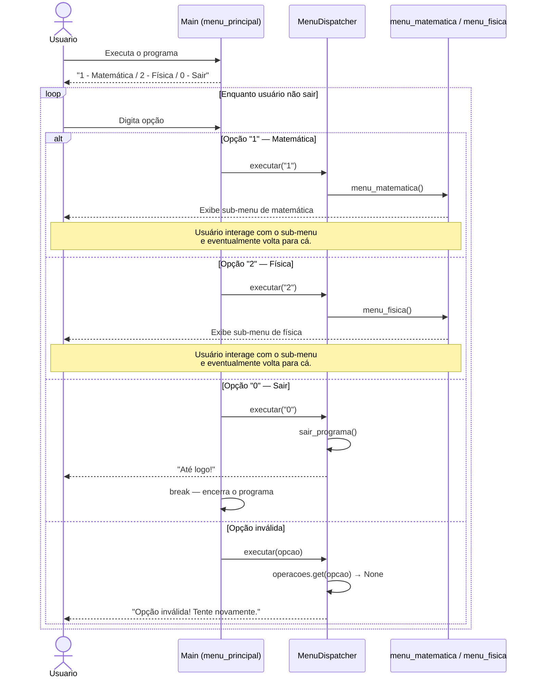

# DS - US08: Navegar entre Matemática e Física

**User Story:** Como usuário, eu quero escolher entre operações de Matemática e Física, para que eu possa acessar rapidamente a funcionalidade desejada.

---

