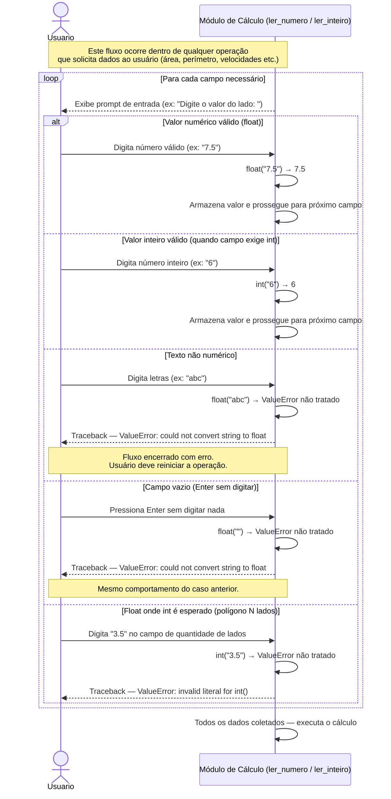

# DS - US09: Informar Dados para os Cálculos

**User Story:** Como usuário, eu quero inserir os valores necessários para cada operação, para que eu possa obter resultados corretos.

---

```mermaid
sequenceDiagram
    actor Usuario
    participant Calc as Módulo de Cálculo (ler_numero / ler_inteiro)

    Note over Usuario,Calc: Este fluxo ocorre dentro de qualquer operação<br/>que solicita dados ao usuário (área, perímetro, velocidades etc.)

    loop Para cada campo necessário
        Calc-->>Usuario: Exibe prompt de entrada (ex: "Digite o valor do lado: ")

        alt Valor numérico válido (float)
            Usuario->>Calc: Digita número válido (ex: "7.5")
            Calc->>Calc: float("7.5") → 7.5
            Calc->>Calc: Armazena valor e prossegue para próximo campo

        else Valor inteiro válido (quando campo exige int)
            Usuario->>Calc: Digita número inteiro (ex: "6")
            Calc->>Calc: int("6") → 6
            Calc->>Calc: Armazena valor e prossegue para próximo campo

        else Texto não numérico
            Usuario->>Calc: Digita letras (ex: "abc")
            Calc->>Calc: float("abc") → ValueError não tratado
            Calc-->>Usuario: Traceback — ValueError: could not convert string to float
            Note over Usuario,Calc: Fluxo encerrado com erro.<br/>Usuário deve reiniciar a operação.

        else Campo vazio (Enter sem digitar)
            Usuario->>Calc: Pressiona Enter sem digitar nada
            Calc->>Calc: float("") → ValueError não tratado
            Calc-->>Usuario: Traceback — ValueError: could not convert string to float
            Note over Usuario,Calc: Mesmo comportamento do caso anterior.

        else Float onde int é esperado (polígono N lados)
            Usuario->>Calc: Digita "3.5" no campo de quantidade de lados
            Calc->>Calc: int("3.5") → ValueError não tratado
            Calc-->>Usuario: Traceback — ValueError: invalid literal for int()
        end
    end

    Calc->>Calc: Todos os dados coletados — executa o cálculo
```
