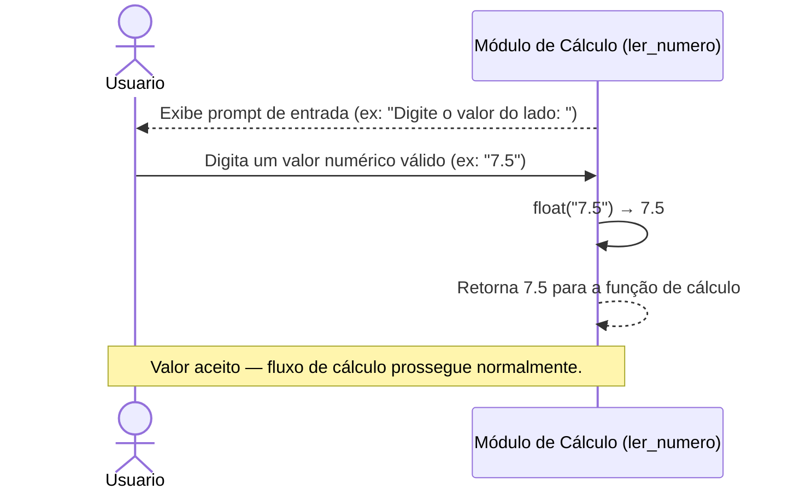
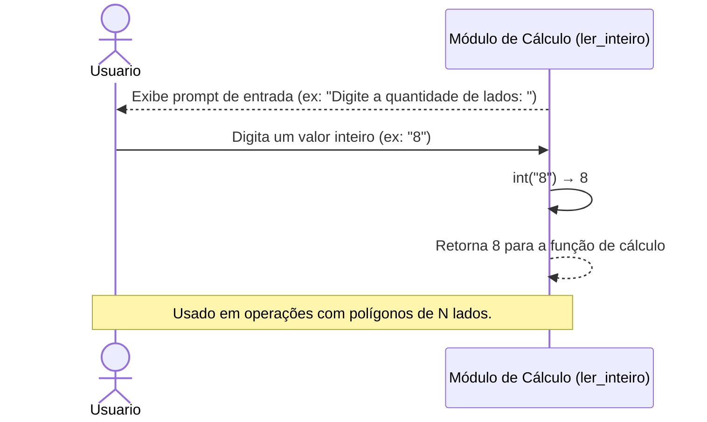
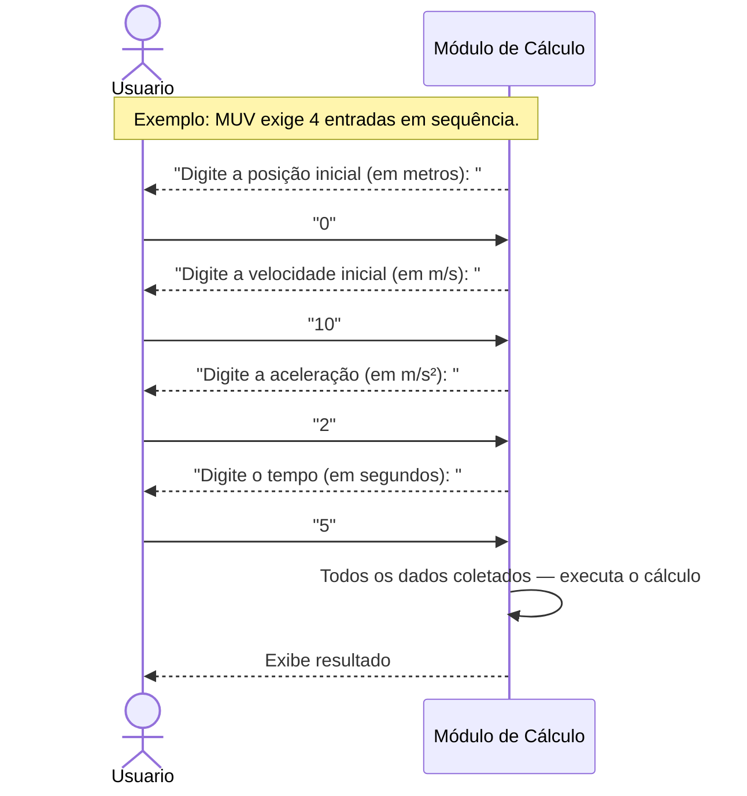
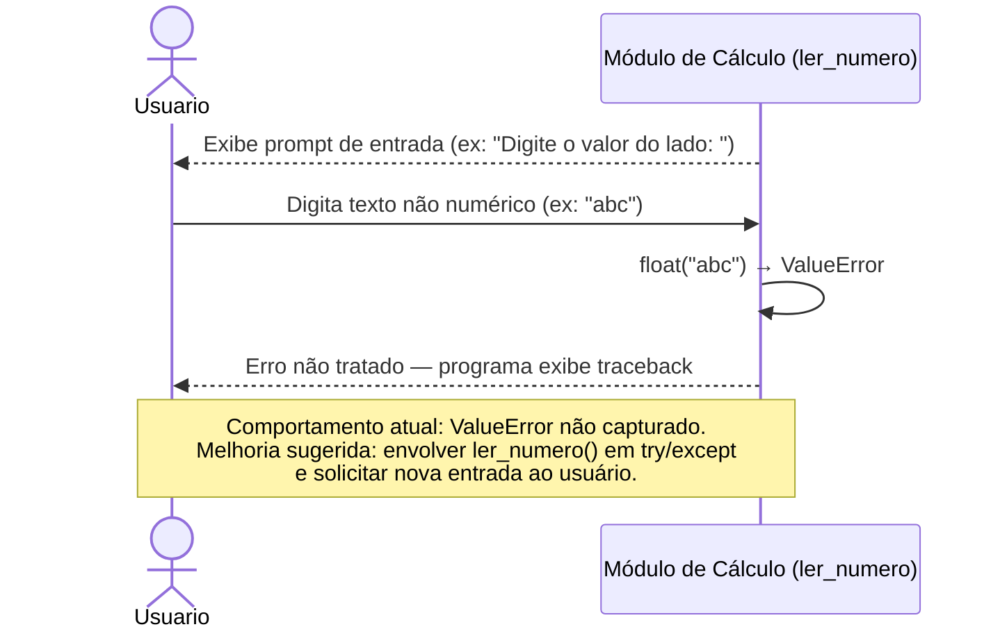
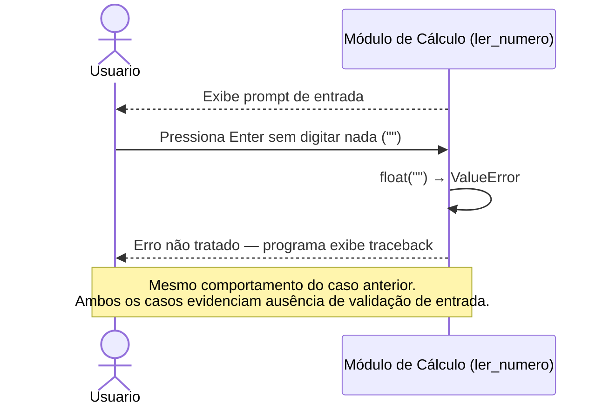

# DS - US09: Informar Dados para os Cálculos

**User Story:** Como usuário, eu quero inserir os valores necessários para cada operação, para que eu possa obter resultados corretos.

> Esta User Story é transversal — ela representa o comportamento de entrada de dados que ocorre em todas as operações do sistema. Os fluxos abaixo mostram o padrão de coleta de dados e os cenários de entrada inválida.

---

## Fluxo Principal — Entrada de Dado Numérico Válido

---

## Fluxo Alternativo — Entrada de Número Inteiro Válido

---

## Fluxo — Múltiplas Entradas em Sequência

---

## Fluxo de Exceção — Dado Não Numérico Informado

---

## Fluxo de Exceção — Campo Deixado em Branco

