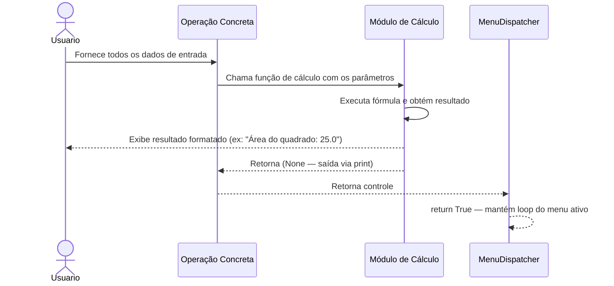
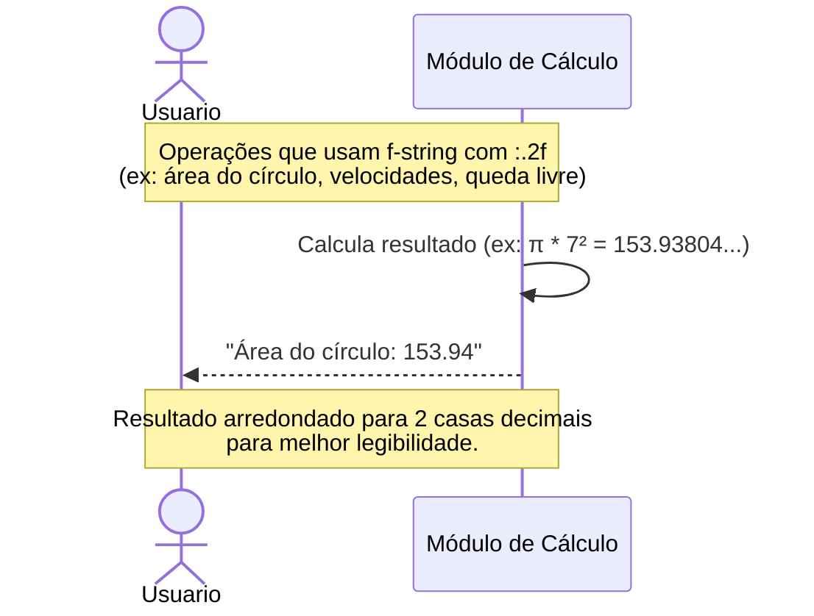
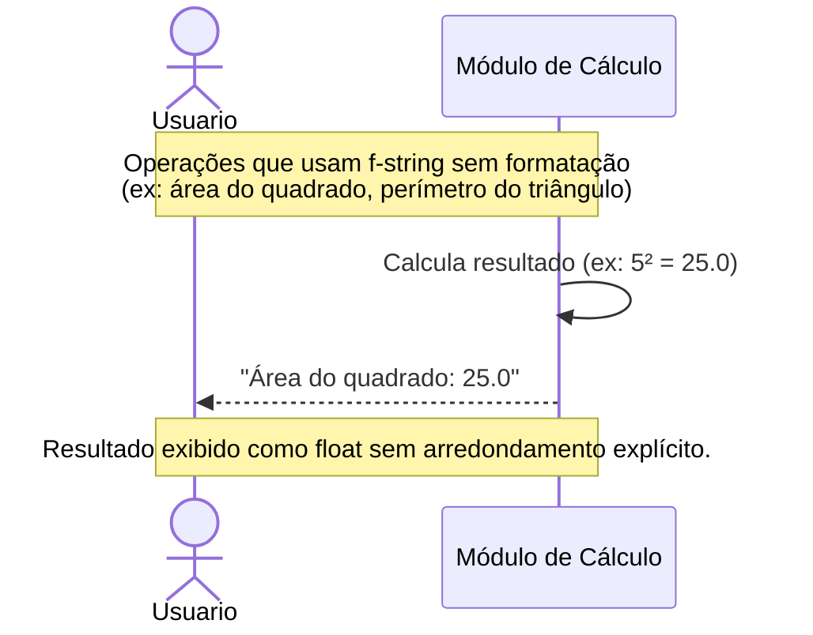
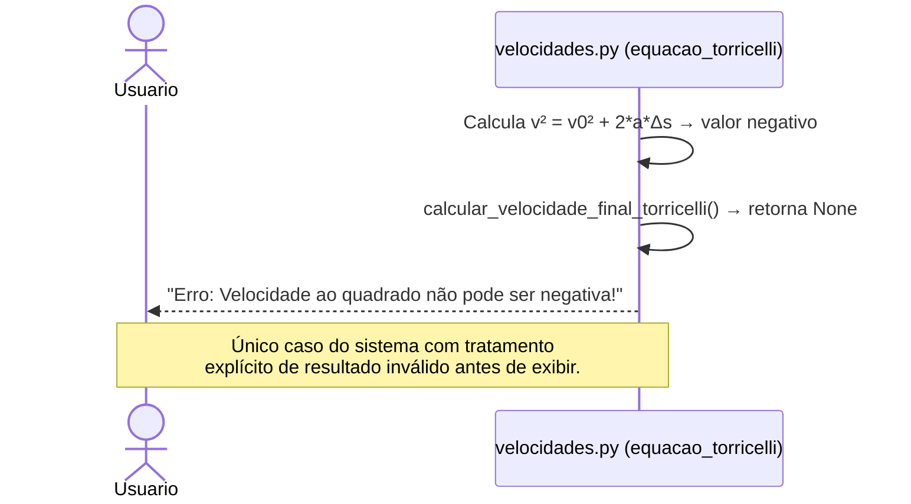
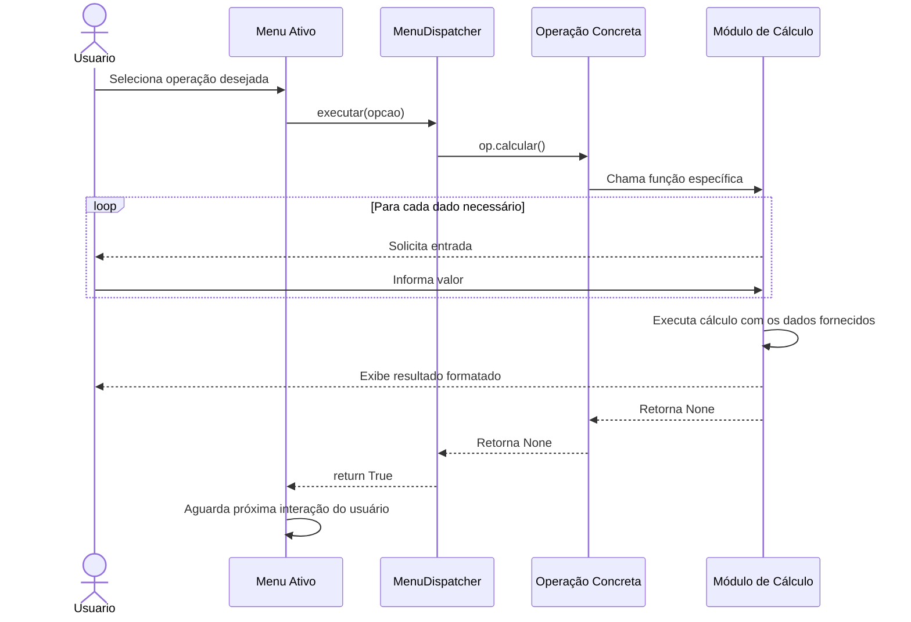

# DS - US10: Visualizar o Resultado

**User Story:** Como usuário, eu quero visualizar o resultado do cálculo, para que eu possa utilizá-lo em meus estudos.

> Esta User Story é transversal — representa a etapa final de toda operação do sistema, onde o resultado processado é exibido ao usuário. Os fluxos abaixo mostram os padrões de exibição e os cenários de saída com erro.

---

## Fluxo Principal — Resultado Exibido com Sucesso

---

## Fluxo Alternativo — Resultado com Formatação de Casas Decimais

---

## Fluxo Alternativo — Resultado Inteiro ou Sem Arredondamento

---

## Fluxo de Exceção — Resultado Inválido (Torricelli negativo)

---

## Fluxo — Sequência Completa: Entrada → Processamento → Exibição

