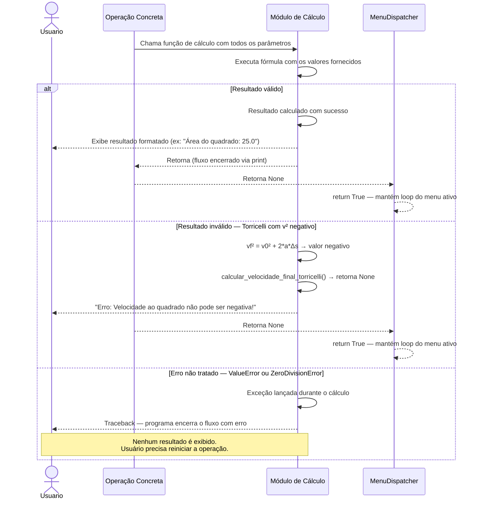

# DS - US10: Visualizar o Resultado

**User Story:** Como usuário, eu quero visualizar o resultado do cálculo, para que eu possa utilizá-lo em meus estudos.

---

```mermaid
sequenceDiagram
    actor Usuario
    participant Op as Operação Concreta
    participant Calc as Módulo de Cálculo
    participant Dispatcher as MenuDispatcher

    Op->>Calc: Chama função de cálculo com todos os parâmetros
    Calc->>Calc: Executa fórmula com os valores fornecidos

    alt Resultado válido
        Calc->>Calc: Resultado calculado com sucesso
        Calc-->>Usuario: Exibe resultado formatado (ex: "Área do quadrado: 25.0")
        Calc-->>Op: Retorna (fluxo encerrado via print)
        Op-->>Dispatcher: Retorna None
        Dispatcher-->>Dispatcher: return True — mantém loop do menu ativo

    else Resultado inválido — Torricelli com v² negativo
        Calc->>Calc: vf² = v0² + 2*a*Δs → valor negativo
        Calc->>Calc: calcular_velocidade_final_torricelli() → retorna None
        Calc-->>Usuario: "Erro: Velocidade ao quadrado não pode ser negativa!"
        Op-->>Dispatcher: Retorna None
        Dispatcher-->>Dispatcher: return True — mantém loop do menu ativo

    else Erro não tratado — ValueError ou ZeroDivisionError
        Calc->>Calc: Exceção lançada durante o cálculo
        Calc-->>Usuario: Traceback — programa encerra o fluxo com erro
        Note over Calc,Usuario: Nenhum resultado é exibido.<br/>Usuário precisa reiniciar a operação.
    end
```
